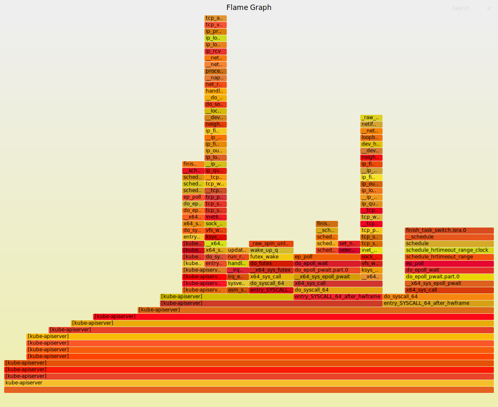

# Objectives
- розгорніть control plane

- створіть debug privileged container з image verizondigital/kubectl-flame:v0.2.4-perf

- зробіть профілювання kube-apiserver: збір семплів з PID (perf record -F 99 -g -p ...)

- побудуйте flame graph (perf script -i /tmp/out | FlameGraph/stackcollapse-perf.pl | FlameGraph/flamegraph.pl > flame.svg)

- скопіюйте flame.svg з контейнера та збережіть у вашому репо

# Steps
## Start the control plane
I've faced some issues with starting the control plane using `setup.sh` because I forgot to remove control plane StaticPods manifests from `/etc/kubernetes/manifests` left from the previous homework.   
Once I've cleaned up `/etc/kubernetes/manifests` the script worked correctly. 

`bash setup.sh start`

## Added kubectl-flame Pod manifests
```yaml
apiVersion: v1
kind: Pod
metadata:
  name: kubectl-flame
spec:
  containers:
    - name: kubectl-flame
      image: verizondigital/kubectl-flame:v0.2.4-perf
      securityContext:
        privileged: true
        capabilities:
          add: ["SYS_ADMIN", "SYS_PTRACE"]
      command: ["/bin/sh", "-c", "sleep infinity"]
  hostPID: true
  hostNetwork: true
  restartPolicy: Never
  tolerations:
  - effect: NoSchedule
    key: node.cloudprovider.kubernetes.io/uninitialized
    operator: Equal
    value: "true"
```
## Apply manifest
`k apply -f perf-flamegraph/pod.yaml`

## Execute profiling
I've used k9s for accessing the shell console of the container.
```sh
# Get kube-apiserver PID
export KUBE_API_SERVER_PID=$(pgrep kube-apiserver)
cd /app
# Start recording. Useful: -o for output file, otherwise perf.data by default. -F samples per second, -g Enable call graph. (stack trace) recording
/app/perf record -F 99 -g -p $KUBE_API_SERVER_PID


^C[ perf record: Woken up 1 times to write data ]
[ perf record: Captured and wrote 0.013 MB perf.data (22 samples) ]
# Stopped recording using CTRL+C. I might have used --duration flag to specify the duration of the recording. 
# Generat flame-graph
/app/perf script -i perf.data  | FlameGraph/stackcollapse-perf.pl | FlameGraph/flamegraph.pl > flame.
svg
```
## Copy the flame.svg from container to workspace
`k cp kubectl-flame:/app/flame.svg ./flame.svg`

## Result
[Flame Graph](perf-flamegraph/flame.svg)

